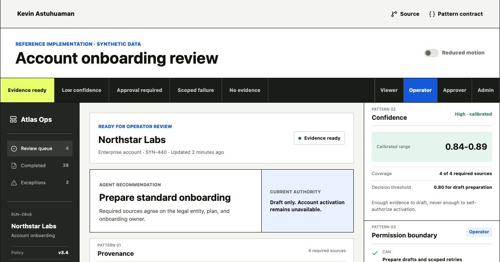

# Enterprise AI Interface Kit

An original, public-safe reference product for the interface decisions that make consequential AI inspectable: evidence, uncertainty, authority, approval, execution, failure, recovery, and absence.

[Live interface](https://kevinastuhuaman.github.io/enterprise-ai-interface-kit/) | [Pattern specification](https://kevinastuhuaman.github.io/enterprise-ai-interface-kit/patterns.json) | [LLM context](https://kevinastuhuaman.github.io/enterprise-ai-interface-kit/llms.txt) | [Kevin Astuhuaman's portfolio](https://portfolio.kevinastuhuaman.com)



## What this proves

This project turns common enterprise AI concerns into explicit product contracts. The reference workflow lets a reviewer switch between five operational states and four user roles while the evidence, decision boundary, approval state, and recovery path update together.

It is intentionally not a generic component gallery. Every pattern answers a user question and prevents a specific product failure.

## Reference states

| State | Product decision |
| --- | --- |
| Evidence ready | Evidence supports draft preparation, but not activation |
| Low confidence | Conflicting sources route the operator to evidence review |
| Approval required | A named approver controls one exact prepared state |
| Scoped failure | Completed work is preserved while one idempotent read retries |
| No evidence | The system explains absence instead of inventing a record |

## Pattern contracts

1. **Provenance chain:** show the evidence behind an output.
2. **Calibrated confidence:** connect uncertainty to coverage and a decision threshold.
3. **Permission boundary:** separate what a system can do from what an actor may do.
4. **State-bound approval:** bind approval to an exact state and invalidate stale consent.
5. **Observable run trace:** expose events and references without private reasoning.
6. **Scoped failure:** name what stopped, what remains valid, and who owns recovery.
7. **Honest empty state:** make missing evidence an explicit product state.

The source of truth is [`src/data/patterns.json`](src/data/patterns.json). The product rationale is recorded in [`DECISIONS/`](DECISIONS/).

## Run locally

```bash
npm install
npm run validate:patterns
npm test
npm run build
npm run dev
```

## Public boundary

All companies, people, policies, identifiers, evidence, and events are fictional. This repository contains no employer assets, customer or applicant data, private prompts, credentials, production infrastructure detail, or proprietary Trackly code. See [`IP-NOTICE.md`](IP-NOTICE.md).

## License

Code is released under the [MIT License](LICENSE). Original written content and visual design remain subject to the terms in [`IP-NOTICE.md`](IP-NOTICE.md).
